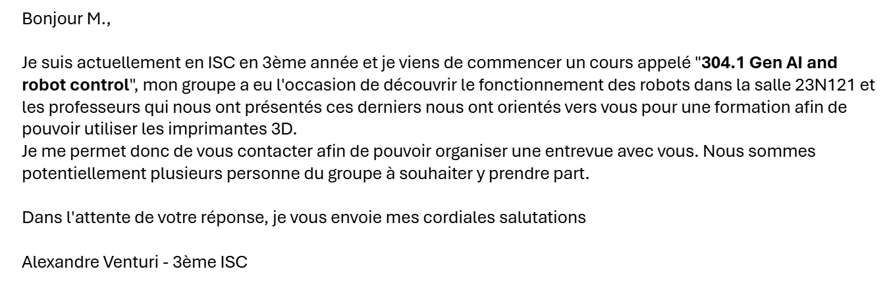

# Week 1

**Date:** 16.02.2026 - 20.02.2026

**Role:** Designer and Responsible of the team *3D Model*

## 16.02.2026

The first day of a project generally start with meeting. So my team and I thought about the repartition of the tasks and I manifest my interest in the modeling part as I have already had some experience with 3D modeling software.

With 3D modeling come 3D printing. That is why I take contact with a professor responsible with the 3D printer available for the students.

And we fixed a meeting for the next day.

## 17.02.2026

As planned, I recieved a formation from Pr. Darbellay to be able to use the 3D printer and took some notes about the configuration and the settings required :

> configuration source que => prusa FFF
> Prusa search MK3 Family
> Original Prusa i3 MK3S&S+ 0.4mm
> Filaments : Profile : Generic PLA (PetG)
> update, on laisse
> Reload from disk, cocher
> file association : .3mf files
> view mode : simpe (advanced)
> Printer : rien changer
> Filament : generic PLA
> Print setting : eviter 0.05 minimum 0.10
> (.stl) format .step (.stp)
> Place on face pour choisir la meilleure face
>
> *Print settings*
> infill : fill patern gyroïd
> Brim : rajouter une surface de contact stabilité
> skirt : laisser
> support : generate support
> Imprimamte : lancer le préchauffage
> alcool avant utilisation et avant préchauffage

After this formation we had a meeting with the CTO and product owner of the project where we were presenting our first ideas on the different aspect of the project. You can find this presentation here : [Firsts objectives of each domain](https://github.com/Toys-R-Us-Rex/Duckify/blob/main/docs/presentations/20260217_initial_planning.typ)

And see what I consider important in the early part of this project.

## 18.02.2026

After recieving all the informations required to use the 3D printer. I started to design some first idea of possible support for elevating duck so its position is more suitable for the robot.

I consider that the support for duck must have two specific characteristics :

- Must not modify the design of duck significatively.

- Take the minimum space possible while making duck stable and fixed in their possition.

I consider theses points important because the supports must match with the robot possibilities and requierement to paint an object as complicated as a duck could be.

## 19.02.2026

This day was mainly focused on gathering information about the setup and the amplitude of the robot. I took time with the robot team to analyse the situation and what could be the disposition of element around the robot. With the discussion I had with the robot team. I planned to design a complete assembly of the setup with support and tools. It has been fixed for the sprint 2 : [Milestone of sprint 2](https://github.com/Toys-R-Us-Rex/Duckify/blob/main/docs/planning/steps_milestones.typ).

## 20.02.2026

The last day of the week we had a weekly meeting with our CTO and product owner to talk about the milestones done during the week and the objectives planned for the next week as seen in the [weekly planning document](https://github.com/Toys-R-Us-Rex/Duckify/blob/main/docs/meetings/weekly/2026-02-20.typ)

